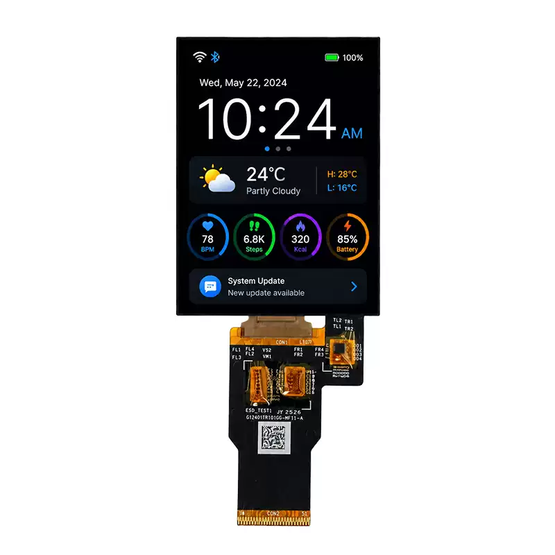

<h1 align="center">OSPTEK 2.4″ AMOLED 450×600 (RM690B0 · SPI / MCU / MIPI)</h1>

<b>AMOLED module · SPI / MCU / MIPI · RM690B0 · Multi-Version Index</b>

English | <a href="./README.md">简体中文</a>

  
  
  
  

## Contents

- [About](#about)
- [Versions](#versions)
- [AM240M450600ZS](#am240m450600zs)
- [Where to Buy](#where-to-buy)
- [Support](#support)

---

## About

This repository holds materials for the **2.4″ 450×600 AMOLED (SPI / MCU / MIPI · RM690B0)** module family.

The **root README is the navigation page**. Use the table below for a quick scan; open **Full docs** to enter that **part-number folder** under `versions/` (product page, datasheets, and examples live there).

Repo id: `amoled-2.4-450x600-mipi-rm690b0`

---

## Versions

| Version | Image | Summary | Full docs |
| ------- | ----- | ------- | --------- |
| AM240M450600ZS |  | [Summary](#am240m450600zs) | [Full docs](./versions/AM240M450600ZS/) |

---

## AM240M450600ZS

**Notes:** 51-pin FPC, no touch.

Full product page, datasheets, and examples: [versions/AM240M450600ZS/](./versions/AM240M450600ZS/)

---

## Where to Buy

  
  &nbsp;&nbsp;
  

**International (AliExpress)**

- Store: [OSPTEK Official Store](https://www.aliexpress.com/store/1105701619)

**China (Taobao)**

- Store: [鱼鹰光电工厂店](https://shop110742373.taobao.com/)

---

## Support

- Technical Support / Sales: <luyu@osptek.com>
- QQ Technical Group: **985881096**
- Website: <https://osptek.com/>
- Feel free to open an Issue in this repository if you have any questions

---

© 2026 OSPTEK · Licensed under CC BY 4.0

